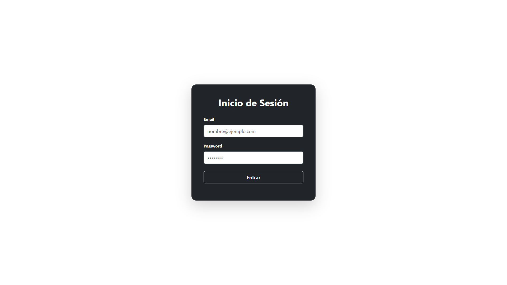
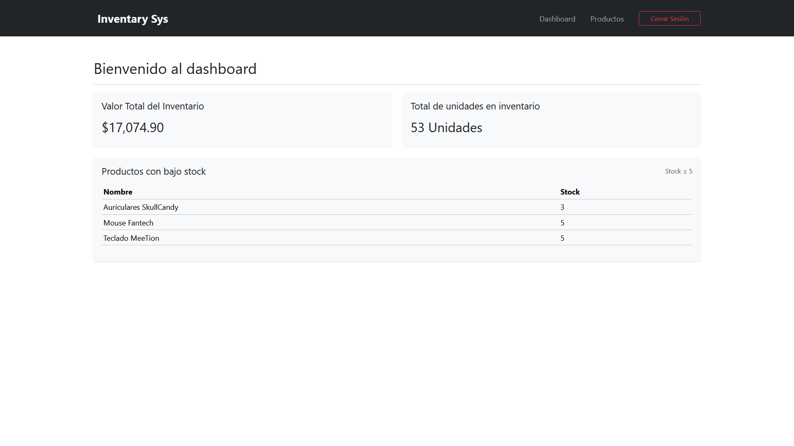
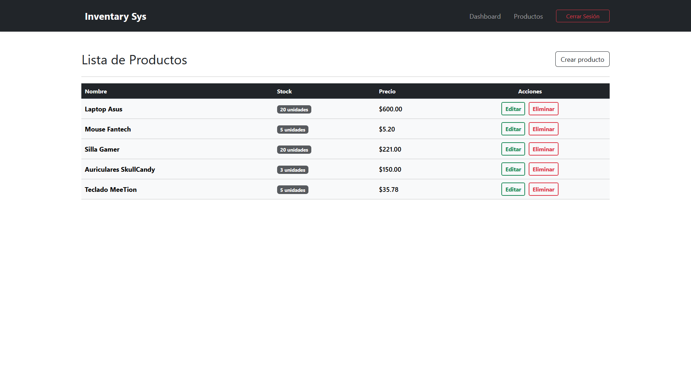

Sistema web de gestión de inventario desarrollado en PHP puro utilizando arquitectura MVC progresiva y Bootstrap para la interfaz.

---

# Inventory Management System (PHP)

Sistema web de gestión de inventario desarrollado en PHP puro con MySQL y Bootstrap.

Este proyecto permite administrar productos mediante un panel administrativo moderno que incluye autenticación, métricas del inventario y alertas de bajo stock.

---

## 🚀 Funcionalidades

- Autenticación de usuarios con sesiones
- CRUD completo de productos
- Dashboard con métricas:
  - Valor total del inventario
  - Total de unidades en inventario
  - Productos con bajo stock (alerta ≤ 5)
- Validaciones backend
- Mensajes flash de confirmación
- Interfaz moderna con Bootstrap
- Arquitectura MVC progresiva (Controller para Dashboard)

---

## 🛠️ Tecnologías utilizadas

- PHP (sin framework)
- MySQL
- Bootstrap 5

---

## ⚙️ Instalación

1. Clonar repositorio:

```TERMINAL
    git clone https://github.com/Nestor-Santamaria/inventory-system-php.git
```

2. Crear base de datos: [config/database.sql](config/database.sql)

3. Configurar conexión: [config/database.php](config/database.php).

4. Ejecutar proyecto en XAMPP: http://localhost/inventory-system-php/

## 🔑 Usuario Demo

Email: admin@test.com  
Password: 12345

---

## 📸 Screenshots

### Login



### Dashboard



### Lista de productos



---

## 👨‍💻 Autor

Néstor Santamaría - Ingeniero en Sistemas y Computación

